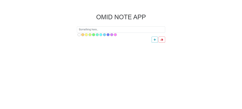

# Notes App

This project is a simple application that allows users to add notes with a custom selected color. Users can save notes and also remove them by clicking on them.

## Features

- **Add a note**: Users can input their desired text and add the note by pressing the "Save" button or the Enter key.
- **Color selection**: Users can choose a color for their note from a predefined list of colors.
- **Delete a note**: By clicking on a note, the note will be deleted.
- **Clear input**: Clicking the "Clear" button will erase the content of the input field.

## How to Use

1. Download or clone the project.
2. Open the HTML file (`index.html`) in your browser.
3. Type your note into the input field.
4. Select a color from the color picker.
5. Press the "Save" button or hit the Enter key to save the note.
6. To delete a note, simply click on it.
7. To clear the input field, click the "Clear" button.

## Project Structure


<div>
  
  
  
</div>

- **HTML5**: For the structure and layout of the webpage.
- **CSS3**: For styling the page, including note elements, color selectors, and responsiveness.
- **JavaScript**:  For handling the functionality behind adding and deleting notes, as well as managing dynamic color selection and event handling on the page.


## Screenshot



## Running the Project

To run this project, follow these steps:

1. Download the project files.
2. Open the `index.html` file in your browser.
3. Use the app to add, delete, and manage colored notes.

## Additional Notes

- When a color is selected, the next note will be displayed with that chosen color.
- If the input field is empty, the save button is disabled, preventing the addition of empty notes.

## Getting Started

To run the project locally:

- Clone the repository:
```bash
    git clone https://github.com/omidhpn/Note-App.git
```